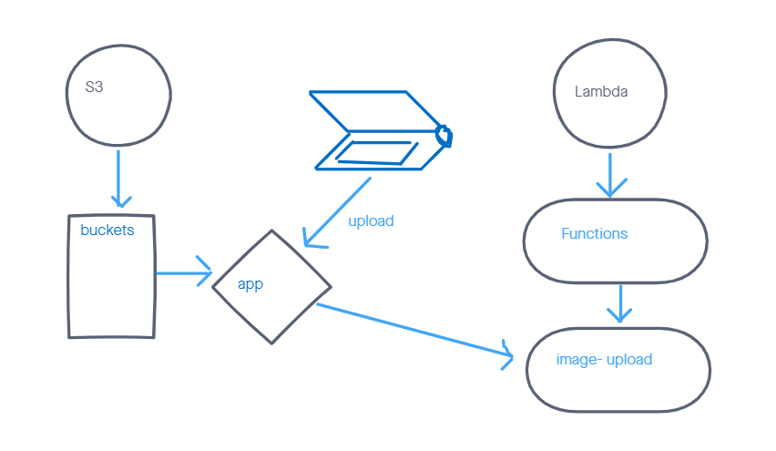

# image-lambda

- AWS Lambda allows writing code that is triggered in the cloud, without thinking about maintaining servers. We’ll use it today to automatically run some processing on image files after they’re uploaded to an S3 Bucket

## Features

- Create an S3 Bucket with "open" read permissions, so that anyone can see the images/files in their browser

- A user should be able to upload an image at any size, and update a dictionary of all images that have been uploaded so far

- When an image is uploaded to your S3 bucket, it should trigger a Lambda function which must:
  - Download a file called "images.json" from the S3 Bucket if it exists
  - The images.json should be an array of objects, each representing an image. Create an empty array if this file is not present
  - Create a metadata object describing the image
    - Name, Size, Type, etc.

- Append the data for this image to the array
  - update the object in the array, don’t just add it

- Upload the images.json file back to the S3 bucket

## UML

- 

## Documentation

### S3

  - first create a  bucket on [AWS S3](https://aws.amazon.com/s3/?nc2=h_ql_prod_st_s3)

  - set permissions to public
  - add this code to bucket policy:
  ```json
  {
  "Version": "2008-10-17",
  "Statement": [{"Sid": "AllowPublicRead",
    "Effect": "Allow",
    "Principal": {
      "AWS": "*"
    },
  "Action": "s3:GetObject",
  "Resource": "arn:aws:s3:::YOUR-BUCKET-NAME/*"
}]}
```
### Lambda

  - The lambda was use to trigger an event

    - 1. Click Configuration for your lamba function
    - 2. Select the role associated with your lambda
        1. Role details should appear: click `attach policy`
        2. Search for the AWS product you would like to permit
        3. Click checkbox next to appropriate policy
        4. click `attack policy` at the bottom.

    - Write function to trigger the event

An issues with the Lambda was writing a code to create an empty array and if this file is not present, Create a metadata object describing the image 

## Contributors

Tim Egorov, Dion Johnson, Kristian Esvelt(TA) and Jacob Knaack(Instructor)

## Link

[]()
